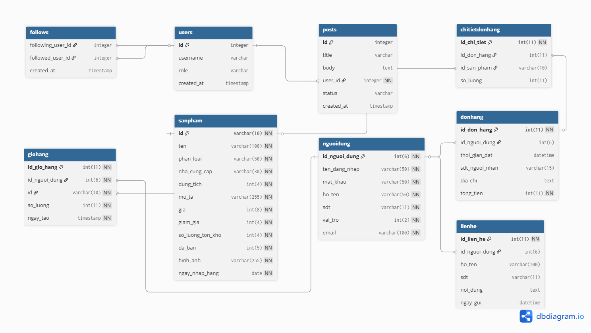
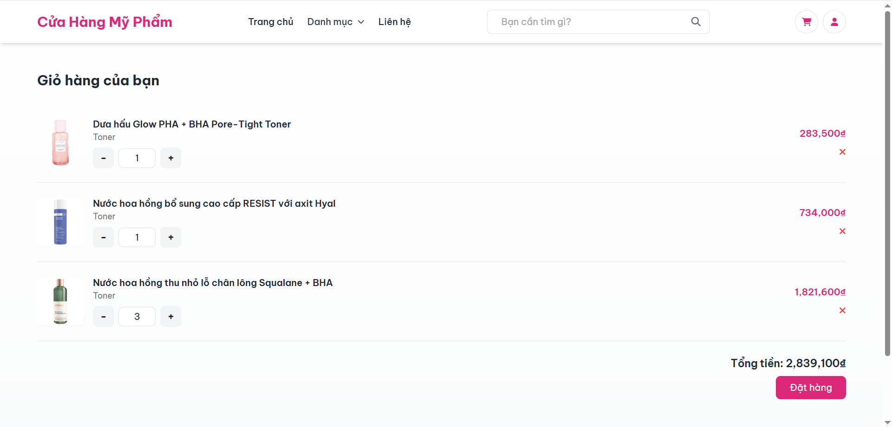
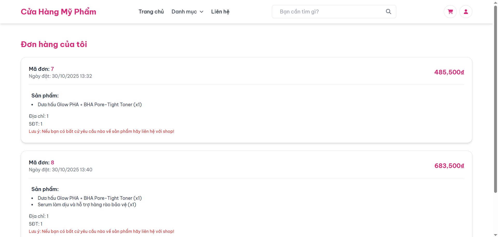
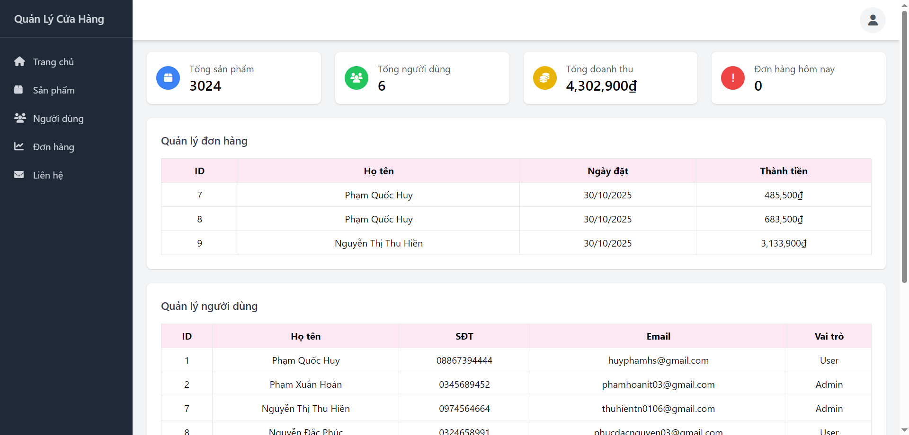

# Website Bán Mỹ Phẩm- Spring Boot

## Giới thiệu
Ứng dụng cho phép người dùng xem sản phẩm, thêm vào giỏ hàng, đặt hàng và theo dõi đơn hàng.

Dự án được thực hiện nhằm rèn luyện kỹ năng phát triển web full-stack bằng Java, với mục tiêu:
- Hiểu rõ mô hình **MVC trong Spring Boot**
- Làm việc với **CSDL MySQL** và **Spring Data JPA**
- Tích hợp **HTML + CSS + Thymeleaf** để tạo giao diện thân thiện
- Xây dựng **chức năng giỏ hàng**, **đặt hàng**, và **quản lý người dùng**

---

## Mục tiêu dự án

- Ứng dụng kiến thức **Spring Boot**, **JPA**, **Thymeleaf**, **MVC** và **MySQL**
- Xây dựng hệ thống quản lý bán hàng có giao diện web thân thiện
- Rèn luyện quy trình triển khai dự án thực tế và sử dụng Git/GitHub

---
## Tính năng chính

### Người dùng
- Đăng ký, đăng nhập, đăng xuất
- Xem danh sách sản phẩm
- Thêm sản phẩm vào giỏ hàng
- Đặt hàng, xem lịch sử mua hàng

### ️ Quản trị viên (Admin)
- Quản lý sản phẩm (thêm, sửa, xóa)
- Quản lý đơn hàng và người dùng
- Thống kê doanh thu (nếu có mở rộng)

---

## Công nghệ sử dụng
| Thành phần | Công nghệ |
|-------------|------------|
| Backend | Spring Boot 3.x |
| View Engine | Thymeleaf |
| CSDL | MySQL |
| ORM | Spring Data JPA |
| Ngôn ngữ | Java 17 |
| IDE | IntelliJ IDEA |

## Kiến trúc dự án

Dự án sử dụng mô hình **Spring Boot MVC mở rộng (Controller - Service - Repository)**, giúp tách biệt rõ:
- Giao diện (View)
- Điều khiển (Controller)
- Logic nghiệp vụ (Service)
- Truy cập dữ liệu (Repository)

---

## Cách chạy dự án

Dự án được phát triển bằng **Spring Boot 3.x**, **Java 17**, **MySQL** và **Maven**.  
Bạn có thể chạy bằng **IntelliJ IDEA**, **Eclipse**, hoặc **Terminal**.

---
## Diagram SQL

## Ảnh demo giao diện

### Trang chủ

### Giỏ hàng

### Đơn hàng đã đặt

### Trang admin
